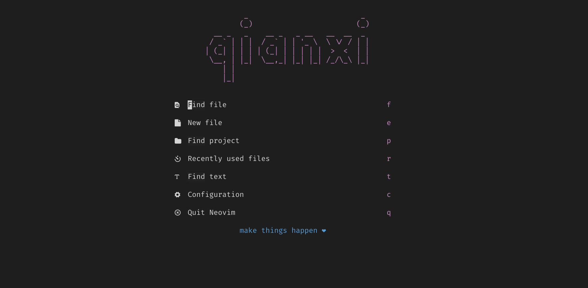
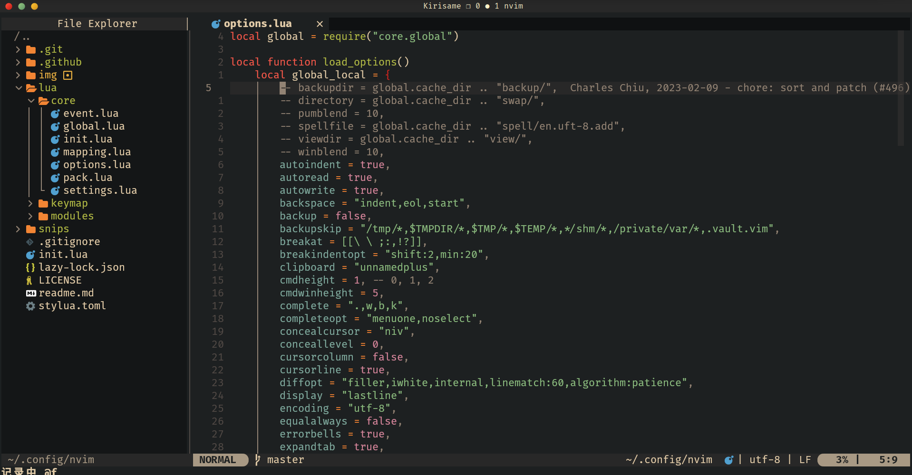
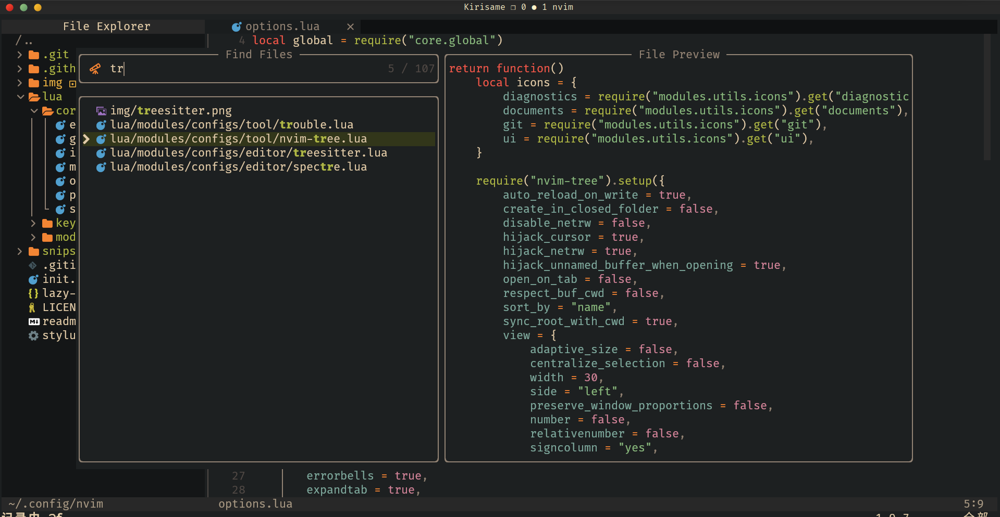
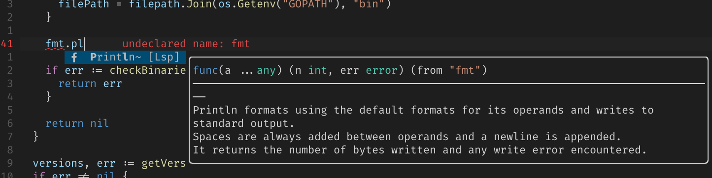
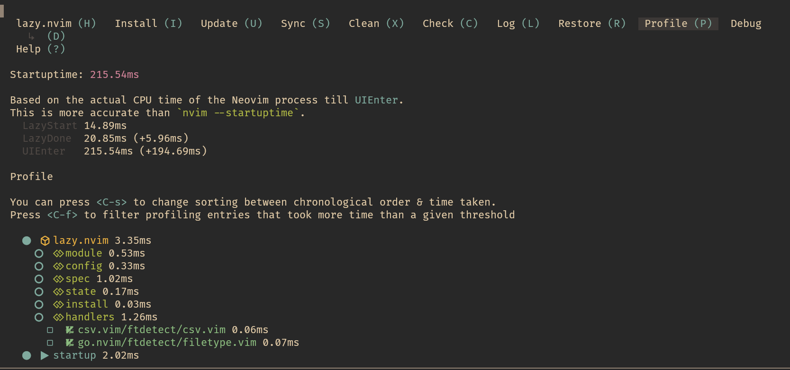

<h1 align="center">(Neo)Vim Config</h1>

## 使用方法

```bash
git clone https://github.com/qianxi0410/.nvim ~/.config/nvim
```

## 预览









## 解决方案

[lazy.nvim](https://github.com/folke/lazy.nvim) +
[nvim-lsp](https://github.com/neovim/nvim-lspconfig) +
[nvim-cmp](https://github.com/hrsh7th/nvim-cmp)

启动速度为：


